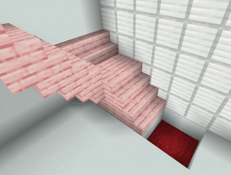
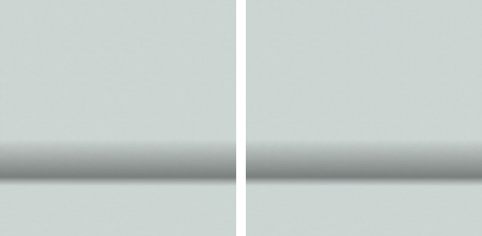

# Minecraft Iris Soft-Body Sphere

A lightweight soft-body sphere simulation running inside Minecraft through Iris and OpenGL shaders.

## Features

<p align="center">
  
</p>

An interactive soft-body sphere that collides with in-game geometry. The sphere responds to gravity and can bounce and roll on blocks, with simulated friction.

<p align="center">
  
</p>

Solver parameters are adjustable through the in-game shader settings, allowing you to make the sphere softer or firmer.

<p align="center">
  
</p>

The simulation includes fluid forces and entity interactions. Adjustable buoyancy allows the sphere to float, while flow-direction logic lets water currents carry it along. Entities can push or propel the sphere through proximity-based contact.

## Sphere Mesh and Custom Mesh Import

From the unpacked shader pack directory, run these commands using Python 3:

```sh
python3 tools/build_sphere.py
python3 tools/obj_to_texture.py assets/your_mesh.obj
```

The first command rebuilds the default sphere. The second imports a custom, closed, outward-wound OBJ mesh, automatically triangulates its polygon faces, then centers and scales it to unit radius. Shared vertex indices become shared simulation particles.

The solver supports up to **256 vertices** and **1,024 triangles**. The default sphere uses subdivision level 2.

The baker updates the textures, generated mesh definitions, and texture and buffer sizes together. Reload the shader pack after importing a mesh.

## References and Acknowledgments

**Most of this codebase was generated with GPT-6 Astra. It should therefore not be attributed entirely to me as original, independently authored code.**

The soft-body solver is based on the methods described in the following papers:

- **Position Based Dynamics** — Matthias Müller, Bruno Heidelberger, Marcus Hennix, and John Ratcliff (2007).
- **XPBD: Position-Based Simulation of Compliant Constrained Dynamics** — Miles Macklin, Matthias Müller, and Nuttapong Chentanez (2016).

<details>
<summary>BibTeX citations</summary>

```bibtex
@article{muller2007position,
  title     = {Position based dynamics},
  author    = {M{\"u}ller, Matthias and Heidelberger, Bruno and Hennix, Marcus and Ratcliff, John},
  journal   = {Journal of Visual Communication and Image Representation},
  volume    = {18},
  number    = {2},
  pages     = {109--118},
  year      = {2007},
  publisher = {Elsevier}
}

@inproceedings{macklin2016xpbd,
  title     = {{XPBD}: position-based simulation of compliant constrained dynamics},
  author    = {Macklin, Miles and M{\"u}ller, Matthias and Chentanez, Nuttapong},
  booktitle = {Proceedings of the 9th International Conference on Motion in Games},
  pages     = {49--54},
  year      = {2016}
}
```

</details>

